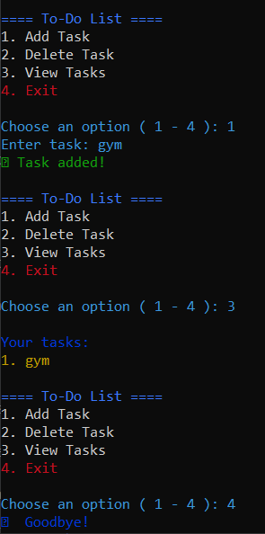

# 📝 To-Do List CLI with Color Output

A colorful command-line task manager with persistent storage, built with Python.


*(Replace with actual screenshot after uploading)*

## 🌟 Features
- Add/delete/view tasks
- Persistent storage in `task.txt`
- Color-coded interface using `colorama`
- Error handling for invalid inputs
- Emoji-enhanced feedback

## 🛠️ Technologies Used
- Python 3.x
- Colorama (for cross-platform colored text)

## ⚙️ Installation
1. Clone the repository:
   ```bash
   git clone https://github.com/your-username/todo-cli.git